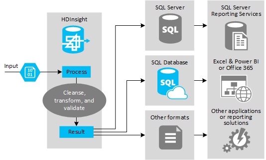

    <h1 align="center"> Artesanato de dados (0.9α)</h3>

 

> O intuito principal desse repositório é desenvolver, demonstrar e documentar parte do conhecimento que adquiri através de estudos sobre a área da Ciência/Engenharia de dados. Durante o decorrer desse projeto vamos passar por todas as etapas do fluxo do Big Data, da sua ingestão inicial de dados até a produção dos insights e propostas de intervenção.

----

<h1 align="center"> RoadMap</h1>

 

- [Introdução](#introduction)
- [Objetivo](#objective)
- [Stack](#stack)
- [Extração](#extraction)
- [Transformação](#transformation)
- [Load](#load)
- [Análise e visutalização](#analysis)

## Introdução 
​	Foi definido como objeto de estudo a **MANUFATURA**. Apesar de ser um tema bastante amplo, conseguir bases de dados se mostrou um desafio, já que dificilmente uma empresa abriria mão de bases de dados a um terceiro. Tendo em vista o desafio que encontramos ao procurar fontes de dados mais voltadas a *players* do mercado, passamos a buscar, então, dados públicos e governamentais, dentre eles dados históricos da **CNI** (Confederação Nacional da Indústria) e dados de reclamações disponibilizados pelo **PROCON** a nível nacional.

###### 

​	

## Objetivo <a name ="objective">

Com o processamento e análise desses dados buscamos: 

1. Qualificar a persona que mais abre reclamação.
2. Identificar quais os problemas no pós-venda.
3. Propor *insights*.

## Stack <a name ="stack">

Só agora com a definição mais precisa do escopo de projeto definimos o *stack* de ferramentas que utilizaremos.

  - **Hadoop(HDFS/YARN) -** 

    > Sistema de arquivos distribuído com alta tolerância a falha, além de alta disponibilidade e baixo custo de implementação. Apesar de ter entrado em desuso muito por conta da mudança de paradigma da Engenharia de Dados ter se voltado ao PaaS (Plataform as a Service), o **HDFS** ainda vê os seus dias de gloria como um Data Lake de baixo custo no cenário on-premise e é ele que usaremos como nosso **Data Lake**.

    
    
    > **YARN** é simplesmente o gerenciador de recursos e jobs, componente essencial do ecossistema Hadoop para processamento distribuído.

  - **PySpark(Spark) -**

    > Nada mais é que uma **API python** para trabalhar sobre o Spark. O **Spark**, por sua vez, é uma *engine* de processamento de dados em larga escala, sendo muito mais veloz que o Hadoop M/R. Parte da sua velocidade advém principalmente do fato que o Spark faz uso de armazenamento em **memória** o que lhe garante ampla vantagem sobre seu irmão mais novo. 
    
    
    
    

  - **Jupyter Notebook -**

    > Ferramenta principal do Cientista de Dados. O **Jupyter** pode ser configurado para realizar *queries* e *tratamentos* fazendo uso da engine Spark e se integra muito bem ao ecossistema Apache/Hadoop/Spark.

  - **PostgreSQL -**

    > SGBD número open source número 1 a nível mundial. Famoso pela sua confiabilidade, velocidade e suporte é o mais utilizado no eco sistema de Big Data em todo mundo. É o destino final de nossos dados.

  - **Airflow** -

    > Uma ferramenta para orquestração de fluxo de dados de maneira escalonável e simples. É uma excelente ferramenta para iniciar pelo baixa curva de aprendizado.

----

## 1- Extração <a name ="extraction">

Se dá então inicio ao nosso processo ETL.

Com alguns poucos providers estabelecemos um fluxo automatizado que faz a sondagem da nossa *staging area* por novos arquivos e os insere em nosso Data Lake. Nessa fase os dados podem se apresentar nos mais diversos formatos(SQL, XML, CSV, PDF), estruturados e não estruturado. Nessa fase de ingestão inicial a `velocidade` é fundamental, por isso os dados são ingestados puros, sem tratamento prévio, mas ainda sim se atentando em manter um seus dados *catalogáveis* e com *governança* evitando que seu Data Lake vire um Data Swamp(pântano de dados).

 

 

 

## 2-Transformação <a name ="transformation">

Após finalizado nosso processo de extração, é dado início a nossa fase de transformação. Nessa fase fazemos o tratamento de dados tais quais a `limpeza` de dados faltantes ou nulos, `desnormalização` de dados que podem advir de bancos distintos ou pela `normalização` de tabelas relacionais de um mesmo. Também é pertinente a essa área a `filtragem` de atributos/colunas que sejam relevantes ou impactantes a análise a ser desenvolvida.

 

## 3-Carregamento <a name ="load">

 

Ao final da fase de **transformação** já é inciada a fase  de **load**, onde os nossos DataFrame com os dados tratados são finalmente carregados no nosso Data Warehouse para posteriormente serem consumidos. Aqui de fato é 

 

## Análise e visualização <a name ="insight">

Após o fim do nosso processo **ETL** os dados podem ser consumidos diretamente do`Data Warehouse` por uma ferramenta de BI. Nesse projeto utilizamos o **Google Data Studio** que já disponibiliza um conector a bancos PostgreSQL.

Em primeira análise observamos um descritivo geral dos motivos da reclamação:

Em um segundo gráfico, filtramos apenas as reclamações referentes a 'Carro Nacional Zero' e 'Carro importado' podemos visualizar melhor quais as maiores causas de insatisfação dos consumidores na aquisição de um carro novo.

A exploração de bases relevantes possibilita a extração de insights que auxiliam a empresa na tomada de decisões. Em uma rápida análise é possível perceber que um dos principais motivos de reclamação é sobre prazos de entrega,  que podem ter como causa tanto o questões inerentes a fabricação e montagem, quanto por problemas de logística.

Uma análise demográfica mais apurada também nos possibilita identificar onde o nosso público alvo mais se concentra, permitindo um investimento eficaz. 

Com a análise criteriosa dos dados é possível construir em detalhes quem é a *persona* do nosso consumidor. Uma vez definido o nosso *target* podemos, por exemplo, estabelecer uma estratégia de marketing com maior excelência e assertividade no intuíto de melhorar o *branding* da empresa.

